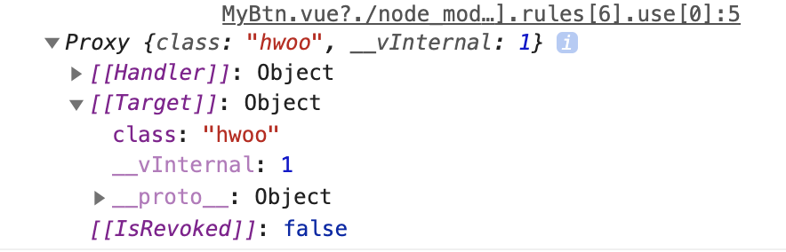
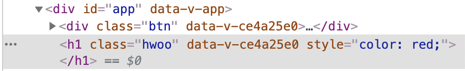
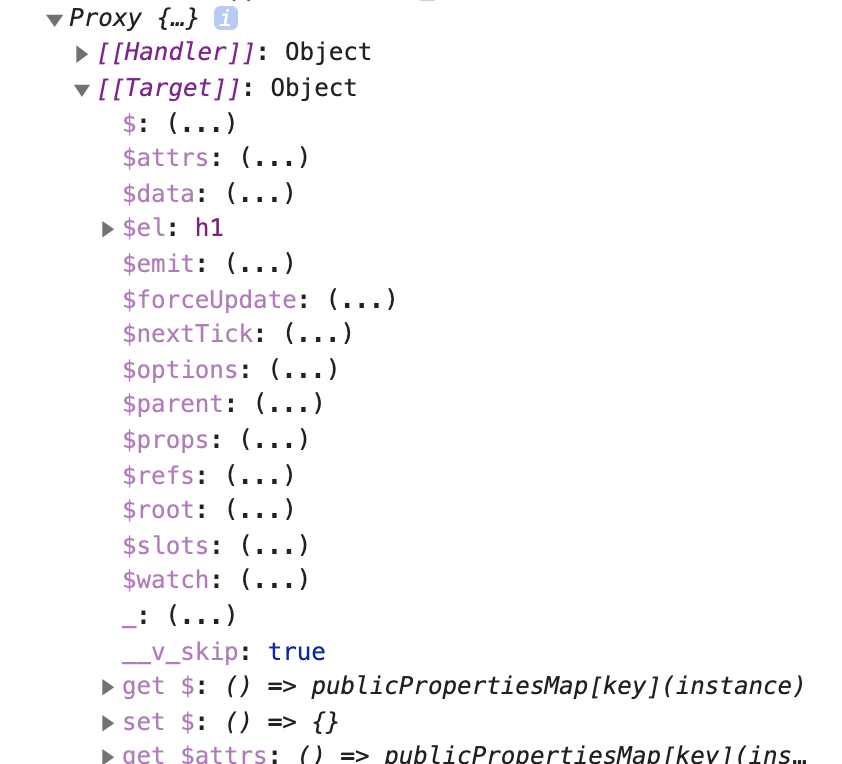

# Component 기초

## props

부모 - 자식 간의 데이터 통신을 구현화 하기 위한 방법

```html
// App.vue
<template>
  <MyBtn />
  <MyBtn color="royalblue" />
</template>

<script>
  import MyBtn from "~/components/MyBtn";

  export default {
    components: {
      MyBtn,
    },
  };
</script>
```

```html
// components/MyBtn.vue
<template>
  <div class="btn" :style="{ backgroundColor: color }">Apple</div>
</template>

<script>
  export default {
    props: {
      color: {
        type: String,
        default: "gray",
      },
    },
  };
</script>
```

### - slot

부모 컴포넌트에서 자식 컴포넌트를 사용하면서 해당 컴포넌트 사이에 작성한 내용을 자식 컴포넌트에서 사용할 수 있는 방법.

template 태그 안에서 slot 태그를 사용한다.

```html
<!-- App.vue -->
<template>
  <MyBtn>
    <span style="color: red;">Banana</span>
  </MyBtn>
</template>

<script>
  import MyBtn from "~/components/MyBtn";
  export default {
    components: {
      MyBtn,
    },
  };
</script>
```

```html
<!-- components/MyBtn.vue -->
<template>
  <div class="btn">
    MyBtn
    <slot></slot>
  </div>
</template>
```

## 속성 상속

template 태그의 바로 아래 요소를 `최상위 요소 (루트)` 라고 한다.
그리고 이 최상위 요소는 컴포넌트에 연결된 값들이 <u>상속</u>되게 된다.

```html
<!-- App.vue -->
<template>
  <MyBtn class="hwoo"> Banana </MyBtn>
</template>

<!-- ... -->
```

```html
<!-- components/MyBtn.vue -->
<template>
  <div class="btn">
    <slot></slot>
  </div>
</template>

<!-- ... -->
```

위 코드를 실행하여 element 를 확인해보면 div태그 class 목록에 'btn' 뿐 아니라 'hwoo'도 적용되는 것을 확인할 수 있으며, 속성이 상속되었음을 알 수 있다.

- 주의) 최상위 요소가 여러 개 일 경우 어떤 요소가 상속을 받아야 할 지 모르므로 상속이 되지 않는다.

```html
<!-- components/MyBtn.vue -->
<!-- 상속되지 않음 -->
<template>
  <div class="btn">
    <slot></slot>
  </div>
  <div></div>
</template>

<!-- ... -->
```

### - inheritAttrs

- 컴포넌트가 상속을 받을 것인지에 대한 여부를 지정하는 옵션

```html
<!-- components/MyBtn.vue -->
<template>
  <div class="btn">
    <slot></slot>
  </div>
</template>

<script>
  export default {
    inheritAttrs: false,
  };
</script>
```

- 컴포넌트가 생성될 때 연결된 속성값을 확인하는 법 (`$attrs`)
- class 명인 'hwoo' 가 target 에 명시 되어 있음을 알 수 있다.

```html
<!-- components/MyBtn.vue -->
<!-- ... -->
<script>
  export default {
    created() {
      console.log(this.$attrs);
    },
  };
</script>
```



<br/>

- v-bind 를 통해 attrs의 내용 모두를 요소에 적용 시킬 수도 있다. 이 때는 `:` 기호를 사용하지 않도록 한다.

```html
<!-- App.vue -->
<template>
  <MyBtn class="hwoo" style="color: red;">Banana</MyBtn>
</template>

<!-- ... -->
```

```html
<!-- components/MyBtn.vue -->
<template>
  <div class="btn">
    <slot></slot>
  </div>
  <h1 v-bind="$attrs"></h1>
</template>
```

- h1 태그에 class 속성과 style 속성이 모두 연결 되어 있다.
  

<br/>
<br/>

## emit

상위 컴포넌트에서 사용되는 메서드를 하위 컴포넌트에 연결하여 사용할 때에 사용된다.

```html
<!-- App.vue -->
<template>
  <MyBtn @click="log"> Banana </MyBtn>
</template>

<script>
  import MyBtn from "~/components/MyBtn";

  export default {
    components: {
      MyBtn,
    },
    methods: {
      log() {
        console.log("Click!!!");
      },
    },
  };
</script>
```

```html
<!-- components/MyBtn.vue -->
<template>
  <div class="btn">
    <slot></slot>
  </div>
  <h1 @click="$emit('click')">ABC</h1>
</template>

<script>
  export default {
    emits: ["click"],
  };
</script>
```

- `App` 컴포넌트에서 명시한 `MyBtn`의 @click:"log" 부분은 `App` 파트에서 실행되는 것이 아니라 `MyBtn`의 emits 로 넘어간 후 h1 @click 부분에서 실행되는 것이므로 `App` 파트에서 굳이 click이라는 속성 이름을 부여할 필요는 없다.
- 이름을 수정할 경우 emits 부분에서 연결하는 이름도 잘 수정해주어야 한다.
- 아래 코드는 위 코드와 같이 동작한다.

```html
<!-- App.vue -->
<template>
  <!-- 수정한 부분 -->
  <MyBtn @hello="log"> Banana </MyBtn>
</template>

<script>
  import MyBtn from "~/components/MyBtn";

  export default {
    components: {
      MyBtn,
    },
    methods: {
      log() {
        console.log("Click!!!");
      },
    },
  };
</script>
```

```html
<!-- components/MyBtn.vue -->
<template>
  <div class="btn">
    <slot></slot>
  </div>
  <!-- 수정한 부분 -->
  <h1 @click="$emit('hello')">ABC</h1>
</template>

<script>
  export default {
    // 수정한 부분
    emits: ["hello"],
  };
</script>
```

### - Emit 으로 event 객체 넘기기

```html
<template>
  <div class="btn">
    <slot></slot>
  </div>
  <h1 @dblclick="$emit('click', $event)">ABC</h1>
</template>

<script>
  export default {
    emits: ["click"],
  };
</script>
```

<br/>

### 상위 컴포넌트에서 변경점 감지해보기

emit 을 이용하여 하위 컴포넌트 data 의 변경점을 상위 컴포넌트가 감지하여 그 내용을 출력하는 코드를 작성해본다.

- 하위 컴포넌트의 template 부분에 input 태그를 하나 작성.
- 양방향 데이터 바인딩 (v-model) 을 이용해 input 태그의 내용이 바뀔때마다 msg 가 갱신되도록 함

```html
<input type="text" v-model="msg" />
```

- msg 가 변경될 때 마다 emit 로 연결받은 메소드들 중 changeMsg 가 실행되도록 하고, 그 인자로 msg 를 넘겨주도록 한다.

```javascript
export default {
  data() {
    return {
      msg: "",
    };
  },
  emits: ["changeMsg"],
  watch: {
    msg() {
      this.$emit("changeMsg", this.msg);
    },
  },
};
```

- 상위 컴포넌트에서 changeMsg 가 연결되도록 컴포넌트 태그에 changeMsg 속성을 선언하고 메서드를 부여한다.
- 태그에서는 camelCase 가 적용되지 않으므로 HTML 이 정확히 인식하도록 kebab-case 로 작성한다.

```html
<template>
  <MyBtn @change-msg="logMsg"> Banana </MyBtn>
</template>

<script>
  export default {
    methods: {
      logMsg(msg) {
        console.log(msg);
      },
    },
  };
</script>
```

<br/><br/>

## Slot

앞 서, slot 태그를 사용해 보았다. slot 태그의 위치에는 컴포넌트 태그 사이에 작성된 내용이 대체되어 렌더링 된다.
<br/>
slot 태그 사이의 내용은 컴포넌트 태그 사이의 내용이 없을 때에 출력된다. 이를 보고 `Fallback contents` 라고 한다.

<br/>

### - 슬롯을 이용한 요소의 순서 보장

```html
<template>
  <MyBtn>
    <span>(A)</span>
    <span>(B)</span>
  </MyBtn>
</template>
```

```html
<template>
  <div>
    <slot></slot>
  </div>
</template>
```

- 위 코드가 실행되면 (A)(B) 가 순서대로 출력된다.
- 만약 span 태그의 위치가 서로 바뀐다면 (B)(A) 가 출력될 것이다.
- 이 때 항상 (A)(B) 순서대로 출력됨을 보장해야 한다고 가정했을 때의 코드를 작성해본다.

```html
<!-- # 기호는 v-slot 의 약어이며, 약어를 사용하는 것이 권장된다 -->
<template>
  <MyBtn>
    <template #text>
      <span>Banana</span>
    </template>
    <template #icon>
      <span>(B)</span>
    </template>
  </MyBtn>
</template>
```

```html
<template>
  <div class="btn">
    <slot name="icon"></slot>
    <slot name="text"></slot>
  </div>
</template>
```

- 컴포넌트 태그 내에서 text 부분을 먼저 작성했음에도 불구하고 icon 부분이 먼저 출력됨을 알 수 있다.

<br/><br/>

## Provide 와 Inject

App -> Parent -> Child 순으로 연결되어 있는 구조의 코드가 있다고 가정해본다.

이 때, App 에서 사용되는 data 를 Child 에서 사용하고 싶을 때, 아래와 같이 코드를 작성할 수 있었다.

```html
<!-- App -->
<template>
  <Parent :msg="message" />
</template>

<script>
  import Parent from "~/components/Parent";
  export default {
    components: {
      Parent,
    },
    data() {
      return {
        message: "Hello World!",
      };
    },
  };
</script>
```

```html
<!-- Parent -->
<template>
  <Child :msg="msg" />
</template>

<script>
  import Child from "~/components/Child";
  export default {
    components: {
      Child,
    },
    props: {
      msg: {
        type: String,
        default: "",
      },
    },
  };
</script>
```

```html
<!-- Child -->
<template>
  <div>{{ msg }}</div>
</template>

<script>
  export default {
    props: {
      msg: {
        type: String,
        default: "",
      },
    },
  };
</script>
```

- 이 때, Parent 컴포넌트 내부에서는 사용하지도 않는 msg 를 억지로 받아온 후 Child 컴포넌트의 속성으로 연결하는 불필요한 작업을 한다고 생각할 수 있다.
- 이를 개선하고자 Provide, Inject 를 사용해본다.

```html
<!-- App -->
<template>
  <Parent />
</template>

<script>
  import Parent from "~/components/Parent";
  export default {
    components: {
      Parent,
    },
    data() {
      return {
        message: "Hello World!",
      };
    },
    provide() {
      return {
        msg: this.message,
      };
    },
  };
</script>
```

- provide() 라고 하는 data와 매우 유사한 형태의 옵션을 작성한다.
- msg 라고 하는 데이터를 this.message 로 연결한다.

```html
<!-- Parent -->
<template>
  <Child />
</template>

<script>
  import Child from "~/components/Child";
  export default {
    components: {
      Child,
    },
  };
</script>
```

- Parent 컴포넌트에서는 더 이상 props 부분이 필요가 없어졌다.
- Child 컴포넌트 태그에 속성을 모두 지우고, props 옵션도 모두 지웠다.

```html
<!-- Child -->
<template>
  <div>{{ msg }}</div>
</template>

<script>
  export default {
    inject: ["msg"],
  };
</script>
```

- Child 컴포넌트에서도 더 이상 props 옵션이 불필요해져 모두 삭제하였다.
- inject 라고 하는 옵션을 선언하고 배열 형태로 value를 지정해준다. 그 안의 내용으로 App 에서 provide 한 msg 를 삽입하였다.
- 이렇게 중간 컴포넌트를 거치지 않고도 msg 라고 하는 매개체가 잘 전달됨을 알 수 있다.

### - 반응성 provide

기본적으로 provide 로 만들어진 데이터는 반응성이 적용되지 않는다.

아래 코드는 위 App.vue 코드를 버튼을 클릭했을 때 'Hello World!' 가 'Good?' 으로 변경되도록 변경한 코드이다.

```html
<template>
  <button @click="message = 'Good?'">Click!</button>
  <h1>App: {{ message }}</h1>
  <Parent />
</template>

<script>
  import Parent from "~/components/Parent";
  export default {
    components: {
      Parent,
    },
    data() {
      return {
        message: "Hello World!",
      };
    },
    provide() {
      return {
        msg: this.message,
      };
    },
  };
</script>
```

- 화면에 버튼이 나타나게 되고 버튼을 클릭하면 첫번째 줄의 "Hello World" 는 "Good?" 으로 변경되는 것을 볼 수 있다.
- 하지만 Child 컴포넌트의 msg 는 변경되지 않았다.
- provide 로 전달되는 데이터는 반응성을 제공하지 않기 때문이다.

버튼을 클릭했을 때 Child 의 메세지도 변경되도록 수정해본다.

```html
<!-- App -->
<template>
  <button @click="message = 'Good?'">Click!</button>
  <h1>App: {{ message }}</h1>
  <Parent />
</template>

<script>
  import Parent from "~/components/Parent";
  import { computed } from "vue";

  export default {
    components: {
      Parent,
    },
    data() {
      return {
        message: "Hello World!",
      };
    },
    provide() {
      return {
        msg: computed(() => {
          return this.message;
        }),
      };
    },
  };
</script>
```

- App.vue 의 script 태그 내에 객체 구조 분해로 computed 를 import 받는다. ([참고 - computed](https://github.com/hyunwoo045/vue3-template-syntax))<br/>
  vue 에서 computed 기능을 따로 가져오는 것이다.
- 계산된 데이터를 반환하여 msg 에 들어가 동작함.

```html
<!-- Child -->
<!-- 수정사항 없음 -->
<template>
  <div>Child: {{ msg }}</div>
</template>

<script>
  export default {
    inject: ["msg"],
  };
</script>
```

- 주의해야 할 점은 computed 로 계산된 내용을 그대로 출력하면 아래와 같은 결과를 볼 수 있다.

  `Child: { "_dirty": false, "__v_isRef": true, "__v_isReadonly": true, "_value": "Good?" }`

computed 로 계산된 객체임을 알 수 있음

- 따라서 해당 객체의 value 값만 출력할 수 있도록 아래와 같이 수정해주자.

```html
<!-- Child -->
<template>
  <div>Child: {{ msg.value }}</div>
</template>
<!-- ... -->
```

<br/>

### - provide, inject 정리

- 부모-자식 간 데이터 통신을 위해서는 props 를 사용했다.
- 조상-후손(부모-자식-자식) 간의 데이터 통신을 위해서는 중간에 부모 컴포넌트가 매개체로 필요하다.
- 조상-후손 간 데이터 통신을 간편하게 하기 위해 Provide, Inject 옵션을 활용한다.
- Provide, Inject 는 반응성을 제공하지 않는다.
- 반응성이 필요하다면 computed 기능을 활용할 수 있다.

<br/>

## Refs.

id='hello' 인 h1 태그의 textContent 를 출력하는 간단한 코드가 있다.

```html
<template>
  <h1 id="hello">Hello World!</h1>
</template>

<script>
  export default {
    mounted() {
      const h1E1 = document.querySelector("#hello");
      console.log(h1E1.textContent);
    },
  };
</script>
```

콘솔창에는 Hello World! 가 잘 출력된다. <br/>
이 코드를 vue.js에 어울리는 코드로 작성해보고자 한다.

```html
<h1 ref="hello">Hello World!</h1>
```

- 요소를 'hello' 라는 이름으로 참조한다.

```javascript
export default {
  mounted() {
    console.log(this.$refs.hello.textContent);
  },
};
```

- `$refs` 라는 객체의 참조하고자 한 이름인 'hello'로 들어가서 textContent 를 출력한다.
- 주의) 당연한 얘기지만 라이프 사이클에 의해 mounted 된 후에만 사용해야 한다.

<br/>

### - Component 태그에서의 ref

Component 태그에서 ref 속성이 어떻게 동작하는지 확인하기 위해 우선 `Hello.vue` 파일을 작성한다.

```html
<!-- Hello.vue -->
<template>
  <h1>Hello~</h1>
</template>
```

그리고 App.vue 를 아래와 같이 수정한다.

```html
<!-- App.vue -->
<template>
  <Hello ref="hello" />
</template>

<script>
  import Hello from "~/components/Hello";
  export default {
    components: {
      Hello,
    },
    mounted() {
      console.log(this.$refs.hello);
    },
  };
</script>
```



Proxy 객체가 하나 출력된 것을 볼 수 있다.

많은 속성 중 `$el` 이라고 하는 속성은 해당 컴포넌트의 template 태그 내부의 최상위 요소를 나타내며 현재 h1 태그임으로 h1 이 출력되었다.

`this.$refs.hello.$el` 을 출력하면 <br/>
`<h1>Hello~</h1>` 가 출력되고 <br/>
`this.$refs.hello.$el.textContent` 는 <br/>
`Hello~` 가 잘 출력된다.

- 최상위 요소가 여러개인 경우에는 어떤 태그가 최상위 요소인지 알 수가 없으므로 올바르게 출력되지 않는다.
- 여러 최상위 요소 중에 ref 속성을 추가함으로써 상위 컴포넌트에서 사용할 요소를 지정할 수 있다.

아래와 같이 최상위 코드가 여러개인 경우 지정할 요소에 ref 속성을 추가한다.

```html
<!-- Hello.vue -->
<template>
  <h1>Hello~</h1>
  <h1 ref="good">Good?</h1>
</template>
```

그리고 상위 컴포넌트에서 체이닝을 통해 지정한 하위 컴포넌트의 최상위 요소의 textContent 를 출력할 수 있다.

```html
<!-- App.vue -->
<template>
  <Hello ref="hello" />
</template>

<script>
  import Hello from "~/components/Hello";
  export default {
    components: {
      Hello,
    },
    mounted() {
      console.log(this.$refs.hello.$refs.good.textContent);
    },
  };
</script>
```
