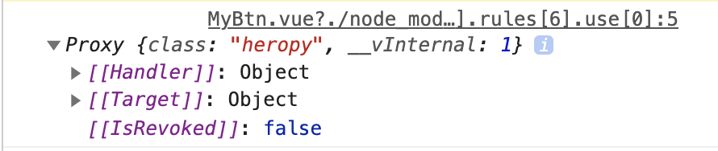

# Component 기초

## props

부모 - 자식 간의 데이터 통신을 구현화 하기 위한 방법

```html
// App.vue
<template>
  <MyBtn />
  <MyBtn color="royalblue" />
</template>

<script>
  import MyBtn from "~/components/MyBtn";

  export default {
    components: {
      MyBtn,
    },
  };
</script>
```

```html
// components/MyBtn.vue
<template>
  <div class="btn" :style="{ backgroundColor: color }">Apple</div>
</template>

<script>
  export default {
    props: {
      color: {
        type: String,
        default: "gray",
      },
    },
  };
</script>
```

### - slot

부모 컴포넌트에서 자식 컴포넌트를 사용하면서 해당 컴포넌트 사이에 작성한 내용을 자식 컴포넌트에서 사용할 수 있는 방법.

template 태그 안에서 slot 태그를 사용한다.

```html
<!-- App.vue -->
<template>
  <MyBtn>
    <span style="color: red;">Banana</span>
  </MyBtn>
</template>

<script>
  import MyBtn from "~/components/MyBtn";
  export default {
    components: {
      MyBtn,
    },
  };
</script>
```

```html
<!-- components/MyBtn.vue -->
<template>
  <div class="btn">
    MyBtn
    <slot></slot>
  </div>
</template>
```

## 속성 상속

template 태그의 바로 아래 요소를 `최상위 요소 (루트)` 라고 한다.
그리고 이 최상위 요소는 컴포넌트에 연결된 값들이 <u>상속</u>되게 된다.

```html
<!-- App.vue -->
<template>
  <MyBtn class="hwoo"> Banana </MyBtn>
</template>

<!-- ... -->
```

```html
<!-- components/MyBtn.vue -->
<template>
  <div class="btn">
    <slot></slot>
  </div>
</template>

<!-- ... -->
```

위 코드를 실행하여 element 를 확인해보면 div태그 class 목록에 'btn' 뿐 아니라 'hwoo'도 적용되는 것을 확인할 수 있으며, 속성이 상속되었음을 알 수 있다.

- 주의) 최상위 요소가 여러 개 일 경우 어떤 요소가 상속을 받아야 할 지 모르므로 상속이 되지 않는다.

```html
<!-- components/MyBtn.vue -->
<!-- 상속되지 않음 -->
<template>
  <div class="btn">
    <slot></slot>
  </div>
  <div></div>
</template>

<!-- ... -->
```

### - inheritAttrs

- 컴포넌트가 상속을 받을 것인지에 대한 여부를 지정하는 옵션

```html
<!-- components/MyBtn.vue -->
<template>
  <div class="btn">
    <slot></slot>
  </div>
</template>

<script>
  export default {
    inheritAttrs: false,
  };
</script>
```

- 컴포넌트가 생성될 때 연결된 속성값을 확인하는 법 (`$attr`)

```html
<!-- components/MyBtn.vue -->
<!-- ... -->
<script>
  export default {
    created() {
      console.log(this.$attrs);
    },
  };
</script>
```


